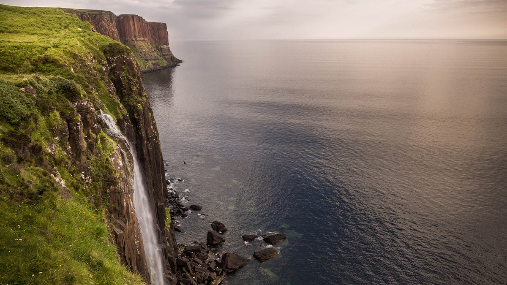

The comforting sounds of Yoko Shimomura's «Dearly Beloved» woke me up on this Sunday morning. Whilst yawning, I tapped on my smartphone to stop the alarm and checked twice whether or not I have some delusions: «Dear lord, it's only 5.30 in the morning...». My girlfriend also fought to get out of bed, but we both knew, it would be worth it – Because that morning, we were about to go the ferry harbour of Mallaig, a beautiful Scottish fisher's village, and head over to the Isle of Skye.

When we left our hotel room and opened the front door, a mild drizzle welcomed us. What do you expect? It's Scotland in September! So we pulled down our hoods into our faces and slowly walked towards the harbour, monitoring all the early workers getting ready to go for a fishing trip.

After a quite shaky half an hour on the ferry, we arrived at the Armadale harbour of the Isle of Skye. The sun has just rose and coloured the sky in a beautiful orangeness – fitting so perfectly with the landscape. Since the public transportation on the Isle of Skye is not the most frequent, especially not on Sundays, we decided to walk the two hours until the bus arrives, instead of waiting for it. It took us a while to understand that on the Isle of Skye the bus stations are not necessarily visible as such; a mere bay next to the road also counts as one. So, after almost missing the bus, we drove to the «heart» of the island: the city of Portree. At least, the buses drive a little more regularly from here.

My personal vacation planner – aka my girlfriend – already knew where we would go first: a sight which she found on the Internet called «Kilt Rock View Point». So, without any further ado, we figured out which bus to take and ended up at what since then is my favourite place on earth:

_Isn't it just a beautiful view?_

But it's not just the view that made me fall in love with this particular place, no. It was the combination of all circumstances, making this the most Scottish place we have ever seen during our 11 days trip throughout the country. We already heard the iconic tones when we alit the bus: a bagpipe. Coming closer to the view point itself, we saw that it was a Scotsman, dressed in the traditional Scottish kilt, playing marvellous pieces of music. It gave me a shiver – of happiness, of course. While enjoying the view and listening to the music, we also noticed a ensnaring smell, coming from a food truck nearby.

So we went towards it and saw that it offered Haggis. I was entrigued, although I never ever wanted to try it – I mean, it's disgusting, isn't it? But my curiosity overwhelmed me, so I bought one, to first share it with my girlfriend. And it was utterly delicious! So, we bought another one!

The combination of this traditional Scottish food, the traditional Scottish music and this iconic view: it has never been more Scottish than that. This is my happy place, my favourite place on earth. And I will always return here.